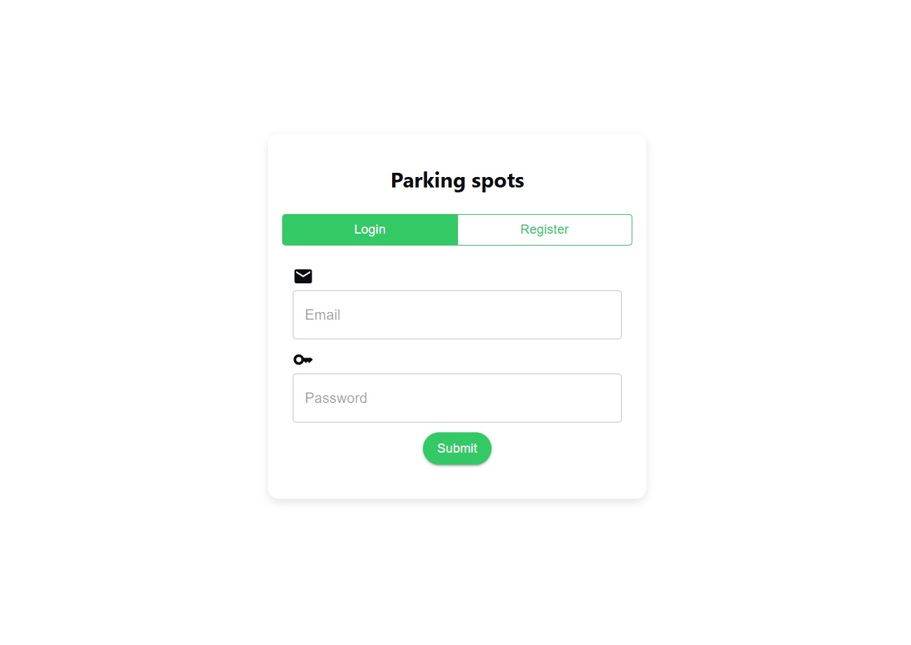
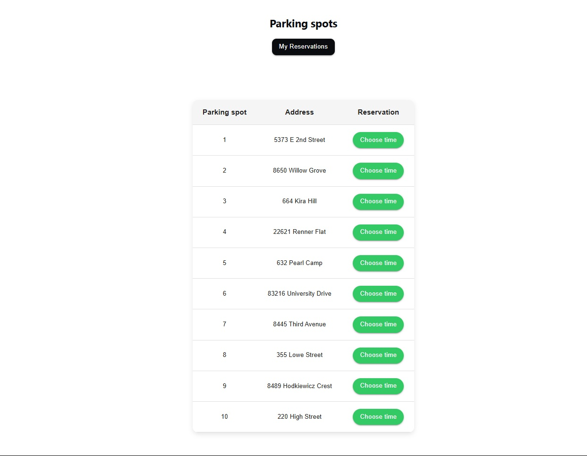
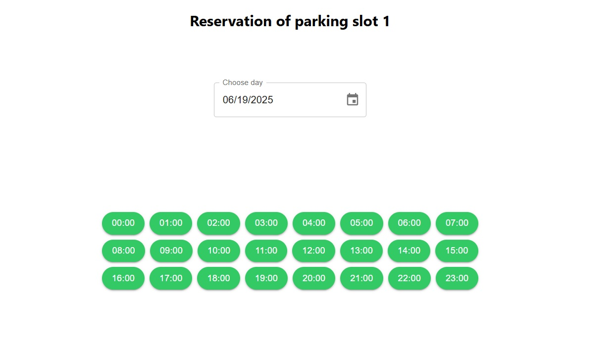
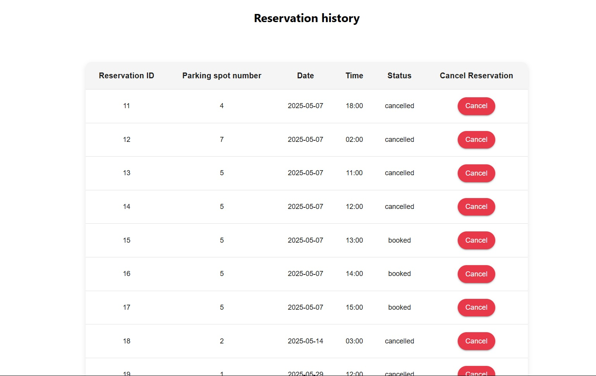

# parking

## 📖 Description

**Parking** is a system for a booking a parking spot.

- 🚗 Explore available parking spots and make a reservation
- ❌ Easily cancel your booking if plans change
- 🧾 Review your past parking bookings anytime

## ⚙️ Installation

### 📋 Requirements

- 🟢 Node.js 20+
- 📦 npm or yarn
- 🐬 MySQL server

### 🚀 Steps

```bash
git clone https://github.com/usovichyuriy/parking.git
```

**Back-end**

```bash
cd parking/backend
npm install
# Create .env based on .env.test with your actual credentials
npm run start:dev
```

**Front-end**

```bash
cd parking/frontend
npm install
# Edit .env with your actual credentials
npm start
```

## ✨ Features

### User Features

🔐 **Authentication**

- Users can create an account in the system
- Users can log in to the system using JWT Authentication

🅿️ **Parking Spot Functionality**

- Authenticated users can browse available parking spots
- Authenticated users can select a parking spot, choose a specific day, and view all available time slots for that date
- Authenticated users can book an available parking spot instantly
- Authenticated users can access their personal booking history
- Authenticated users can cancel bookings if plans change

## 🧑‍💻 Usage

### UI

🧩 Fully responsive design — looks great on desktop, tablet, and mobile devices.

📸 **Screenshots (Desktop)**









### API

📚 **Swagger Documentation:**

Once the server is running (`npm run start:dev`), the API is available at:
http://localhost:3000/api

## 📄 License

This project is licensed under the MIT License - see the [LICENSE](LICENSE) file for details.
